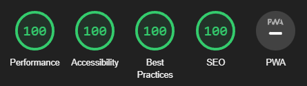

### **
Get Ur Geek
**  
  

 🤪 I’m currently working on this project on my free times 🤪
  
  

  This project is totally personnal, i'm actually doing it from scratch with what i learned in my formation at Becode.
  
  

   

## What is this project ?  
This is a chatting, meeting and dating website for the Geek Community. At the end, you should be able de register and login, completing your profile with your data (age, sex, interest center, ...) and the algorithm will find out the best profiles for you. A good way to find some game partener and why not the love.  
  

   

## Technology used  

  
  
  
  
  
  

  

   

## Connect with me  

  

  

 

## Lighthouse of the website (21/05/2022)

 

----

Link to the <a href="https://saphido.github.io/GetUrGeek/" target="_blank">github page</a>
